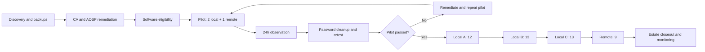
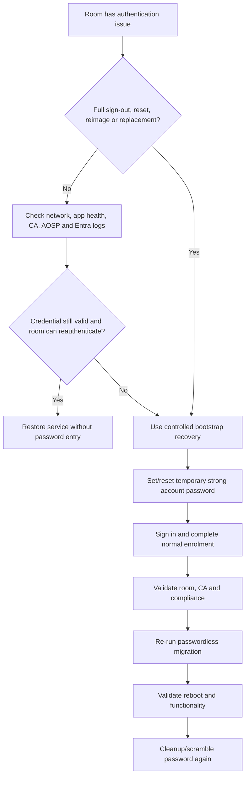

# Microsoft Teams Rooms on Android Passwordless Resource Account Migration

## Executive summary

For this estate of 50 production Microsoft Teams Rooms on Android - 40 local and 10 remote - the recommended design is an in-place authentication transition, not a mailbox replacement or Exchange migration. The existing Exchange `RoomMailbox` objects, SMTP addresses, UPNs, calendars, booking rules, delegates, Room Finder/Places data and Teams Rooms Pro licences should be preserved. Each eligible Logitech Rally Bar room should first be brought to the Microsoft minimum software baseline, validated for Teams Rooms Pro Management visibility, Intune AOSP management where used, and a Conditional Access design that does not force unsupported or disruptive reauthentication. Microsoft then supports an administrator-initiated transition in Teams Rooms Pro Management from stored reusable passwords to a secure Android Keystore-backed, device-bound resource-account credential; after successful migration and validation, the account password can be scrambled or reset to an unknown complex value without signing out the converted device. A full account sign-out, factory reset, reimage or hardware replacement deliberately removes the device-bound credential, so a controlled password bootstrap process remains necessary for break-glass recovery. The safest deployment is a three-room pilot - two local and one remote - followed by three local waves totalling the remaining 38 local rooms and then the remaining nine remote rooms, with password cleanup only after reboot, meeting, calendar, peripheral, compliance and sign-in-log validation. [1][2][3][4]

## Scope, assumptions and target architecture

This report is the definitive reconstructed edition of the migration design. The literal first Deep Research artefact is not available in the active conversation state, so a byte-for-byte restoration of inaccessible text cannot be claimed. Instead, this edition restores every technical topic, command, table, caveat and explanation recoverable from the prior work, corrects the arithmetic defect in the earlier condensed rollout table, and expands the evidence, edge cases and troubleshooting against current Microsoft and Logitech primary documentation as of 30 September 2026.

**Confirmed estate.** The environment contains 50 production rooms: 40 local and 10 remote. The room identities are confirmed Exchange `RoomMailbox` objects. The devices are Logitech Rally Bar based Teams Rooms on Android systems with in-room Logitech touch controllers/panels and Logitech Tap Scheduler devices, and the rooms are currently in service. The user has confirmed Teams Rooms Pro licences are already in use. The operational objective is to eliminate routine dependence on reusable room passwords and reduce incidents in which a room signs out and requires an administrator or site visit to authenticate it again.

**Tenant-specific facts that remain unknown.** The Microsoft 365 tenant ID, Entra tenant name, cloud type, exact Teams Rooms Pro SKU GUID, identity source for each account, Exchange Online versus hybrid details, Conditional Access policy set, Intune enrolment state, AOSP compliance configuration, current device objects, firmware versions, live Teams/Auth/Admin Agent versions, exact room UPNs and SMTP addresses, scheduler sign-in topology, network proxy design, building/Room Finder metadata and remote-hands arrangements are not supplied. They must be discovered rather than assumed. No command in this report hard-codes a tenant ID or licence SKU GUID.

**What is actually changing.** Microsoft describes these room identities as Microsoft 365 resource accounts: mailbox and Teams identities dedicated to a shared resource. The passwordless transition changes the device authentication method only. It does not replace the Exchange mailbox, change normal meeting/calling behaviour, or require a new room identity. Microsoft states that existing resource accounts can be transitioned when eligible and that the converted Android device uses a secure device-bound credential rather than its stored username/password. [1][2]

The target state for each room is therefore:

- The existing Exchange `RoomMailbox` remains the authoritative booking mailbox.
- The existing primary SMTP address and UPN remain unchanged unless discovery exposes an unsupported mismatch; Microsoft requires a Teams Rooms resource account UPN to match its SMTP address. [2]
- Existing calendar-processing settings, delegates, room lists and Microsoft Places metadata are exported and preserved unless a separate booking-policy remediation has been approved. [2]
- The existing Teams Rooms Pro licence remains assigned. Teams Rooms Pro is the appropriate room licence and provides the management/security capabilities used by this design. [7]
- The Rally Bar is transitioned through Teams Rooms Pro Management to the Microsoft passwordless resource-account method after prerequisites are satisfied. [1]
- The account password ceases to be the device's day-to-day authentication secret. After a proven transition, it is cleaned up or scrambled so it is complex and unknown. [1]
- A controlled recovery procedure remains for destructive lifecycle events because reset, reimage, full sign-out or replacement removes the device-bound credential. [1]

The architecture can be represented as follows:

```text
Exchange RoomMailbox + Entra resource identity
                 |
                 | same room identity retained
                 v
       Teams Rooms Pro licence
                 |
                 v
Teams Rooms Pro Management migration
                 |
                 v
Android device-bound credential
      stored in Android Keystore
                 |
                 v
Rally Bar signs in without using
its reusable account password
```

**Why this is more resilient.** Microsoft states that passwordless resource accounts improve sign-in resilience and allow reauthentication attempts without an administrator manually signing the device back in. A converted device should continue to sign in automatically after a restart, and changing the resource-account password does not sign out an already-converted device. On Android, the credential is stored in Android Keystore and is bound to the device rather than being transferable to another endpoint. [1]

This does not mean the identity has no password object at all. Microsoft's current implementation leaves the account password present after migration and explicitly recommends either the Pro Management cleanup workflow or manual password rotation so that the value is complex, secure and unknown. Direct first-time deployment as passwordless is not yet supported: a new, reset, reimaged or replacement device must still be bootstrapped with username/password and then transitioned to passwordless. [1]

**Mailbox conversion is not the project.** Microsoft documents `Set-Mailbox -EnableRoomMailboxAccount` for converting a traditional Exchange room mailbox whose associated account is not enabled for Teams authentication. These 50 rooms are already working Teams Rooms, so that command should not be run indiscriminately. It belongs only in an exception path where discovery proves a specific room mailbox account is not enabled for sign-in. [2]

Exception-only interactive form retained from the earlier runbook:

```powershell
$room = 'ConferenceRoom02'
$password = Read-Host "Enter temporary bootstrap password for $room" -AsSecureString
Set-Mailbox -Identity $room -EnableRoomMailboxAccount $true -RoomMailboxPassword $password
```

Microsoft's documented syntax for modifying an existing room mailbox is:

```powershell
Set-Mailbox -Identity <RoomMailboxIdentity> -EnableRoomMailboxAccount $true -RoomMailboxPassword (ConvertTo-SecureString -String '<Password>' -AsPlainText -Force)
```

Its published example is:

```powershell
Set-Mailbox -Identity ConferenceRoom02 -EnableRoomMailboxAccount $true -RoomMailboxPassword (ConvertTo-SecureString -String '9898P@$$W0rd' -AsPlainText -Force)
```

The published example contains a clear-text demonstration password and should be treated as syntax illustration, not copied into production. [2]

**Panels and schedulers.** A Tap IP used as the room's touch controller is part of the room system and does not need a second Exchange room mailbox merely because it is separate hardware. A Teams Panel such as Tap Scheduler requires explicit account-topology discovery. Microsoft says a Teams Panel signed in with the same resource account as its Teams Room can use the Teams Rooms licence and migrates to passwordless at the same time as that room account. A standalone panel identity has its own account and licensing/authentication lifecycle and must be inventoried separately. [1][8]

## Readiness and control design

The migration should not begin with the passwordless button. It should begin with a complete evidence-backed inventory and with removal of the policy conditions most likely to recreate the very sign-out problem this project is intended to solve.

**Per-room inventory schema.** Use one authoritative record per room and map every physical endpoint to that record. At minimum, capture the following fields before the pilot:

| Category | Field | Why it matters |
| --- | --- | --- |
| Identity | Internal room ID | Stable project key independent of display name |
| Identity | Display name | Operator-facing room name |
| Identity | UPN | Teams/Entra sign-in identity; should match SMTP for Teams Rooms [2] |
| Identity | Primary SMTP | Booking address and Exchange identity |
| Identity | RecipientTypeDetails | Must remain `RoomMailbox` for the confirmed design |
| Identity | AccountEnabled | Confirms Entra sign-in capability |
| Identity | OnPremisesSyncEnabled | Determines cloud-only versus synchronised recovery handling |
| Identity | UsageLocation | Licence/account hygiene field |
| Exchange | AutomateProcessing | Baseline booking behaviour |
| Exchange | BookingWindowInDays | Preserve room-specific booking horizon |
| Exchange | MaximumDurationInMinutes | Preserve booking limits |
| Exchange | AllowRecurringMeetings | Preserve recurrence behaviour |
| Exchange | ProcessExternalMeetingMessages | Important for external invitations [2] |
| Exchange | ResourceDelegates | Preserve approval/delegate model |
| Exchange | Calendar folder permissions | Preserve explicit access grants |
| Exchange | Room list/Places attributes | Prevent Room Finder discoverability regressions [2] |
| Licensing | Teams Rooms Pro licence | Must remain assigned; exact tenant SKU GUID is unknown [7] |
| Site | Local/remote classification | Drives rollout ring and recovery model |
| Site | Building/floor/room | Remote hands and booking mapping |
| Site | Time zone | Resource mailbox should match physical site [2] |
| Rally Bar | Serial number | Hardware identity and support correlation |
| Rally Bar | MAC address | Network and provisioning correlation |
| Rally Bar | IP address | Operational troubleshooting |
| Rally Bar | CollabOS/firmware | OEM baseline; not sufficient alone for passwordless readiness [9][11] |
| Rally Bar | Android version | Passwordless requires Android 10 or later [1] |
| Microsoft apps | Teams Rooms app version | Must meet passwordless minimum [1] |
| Microsoft apps | Authenticator version | Must meet passwordless minimum [1] |
| Microsoft apps | Teams Admin Agent version | Must meet passwordless minimum [1][10] |
| Tap IP | Serial/MAC/IP | Controller mapping and post-change validation |
| Tap Scheduler | Serial/MAC/IP | Panel mapping and remote troubleshooting |
| Tap Scheduler | Account UPN | Determines same-account versus standalone lifecycle [8] |
| Tap Scheduler | Teams Panels app version | Must meet panel passwordless minimum when applicable [1] |
| Management | Pro Management visible/healthy | Both device and resource account must be visible [1] |
| Management | TAC health | Software/update and device-management state |
| Intune | AOSP enrolment state | Required where tenant management/compliance design uses it [4] |
| Intune | Compliance state | Critical where CA requires compliant device [3][4] |
| Entra | Device object ID | Sign-in/compliance correlation and break-glass revocation |
| Security | Resource-account CA group | Confirms intended policy scope |
| Security | Effective CA result | Detects blocking or reauth policies [3][5] |
| Migration | Passwordless eligibility/status | Controls the migration queue [1] |
| Operations | Recovery owner | Named accountable engineer |
| Operations | Remote-hands contact | Mandatory for remote wave |
| Operations | Last validation timestamp | Audit trail |

**Software eligibility.** Microsoft's current passwordless article lists these minimums for Teams Rooms on Android: Android 10 or later, Teams Rooms app `1449/1.0.96.2026129709`, Authenticator `6.2605.3066`, and Teams Admin Agent `1.0.0202606082157`. For Teams Panels it lists Android 10 or later, Teams Panels app `1449/1.0.97.2026164101`, Authenticator `6.2605.3066`, and the same Teams Admin Agent minimum. Both the device and its resource account must also appear in Teams Rooms Pro Management. [1]

| Component | Teams Rooms on Android minimum | Teams Panel minimum | Validation action |
| --- | --- | --- | --- |
| Android OS | 10 or later | 10 or later | Verify on endpoint/TAC/PMP |
| Teams app | `1449/1.0.96.2026129709` | Not applicable | Verify live app version |
| Teams Panels app | Not applicable | `1449/1.0.97.2026164101` | Verify live panel version |
| Microsoft Authenticator | `6.2605.3066` | `6.2605.3066` | Verify live app version |
| Teams Admin Agent | `1.0.0202606082157` | `1.0.0202606082157` | Verify live agent version and PMP eligibility |
| Pro Management | Device and resource account visible | Device and resource account visible | Confirm before scheduling migration |

There is an important Logitech-specific trap. Microsoft's current certified-hardware table lists Logitech Rally Bar firmware `2.1.176` and shows that firmware bundle with Teams client `1449/1.0.96.2026100103`, Authenticator `6.2605.3066`, and Teams Admin Agent `1.0.0.202604060507`. Logitech's own CollabOS 2.1.0/2.1.176 release notes show the same bundled values. The bundled Teams client and Admin Agent are therefore older than the passwordless minimums, even though Authenticator meets the minimum. [9][11]

This does not mean Rally Bar 2.1.176 cannot become eligible. Microsoft documents that Teams Android management applications can be updated independently of OEM firmware, and its app release history lists the June 2026 Admin Agent as `1.0.0.202606082157.product`, with later July and September builds also published. The date/build digits align with the minimum shown in the passwordless article. Consequently, firmware version alone is not a valid readiness test: check the live Teams, Authenticator and Admin Agent versions and rely on Pro Management eligibility rather than assuming the CollabOS bundle is current enough. [1][10][13]

The same point applies to Tap Scheduler. Logitech's CollabOS 2.1.0/2.1.297 release notes bundle Teams Panels `1449/1.0.97.2026164101` and Authenticator `6.2605.3066`, which meet the panel minimums, but bundle Admin Agent `1.0.0.202604060507`, which is older than the passwordless minimum. A live Admin Agent update is therefore a prerequisite even when the scheduler firmware itself appears current. [1][10][12]

**Conditional Access is the largest policy risk.** Microsoft's supported-policy matrix explicitly warns that sign-in frequency causes Teams devices to sign out periodically and that configuring sign-in frequency on individual Microsoft 365 services can interrupt or stop the device sign-in flow. Authentication strength is not supported for Teams Rooms/Android device scenarios, and several user-interactive controls such as Terms of Use, password change, application protection requirements and other session controls are unsupported. Microsoft also warns not to block device-code flow where Android remote sign-in depends on it. [3]

The estate should therefore use a dedicated security group for room resource accounts, for example:

```text
GRP-CA-TeamsRooms-ResourceAccounts
```

The preferred model is to exclude that group from generic human-user Conditional Access policies whose controls are not suitable for shared room devices, and then apply a dedicated room-device policy set. Do not interpret this as a blanket CA bypass. The objective is to secure the accounts with controls that the device can satisfy continuously, such as supported device-compliance requirements, rather than with prompts that need a person standing at the room console. [3][5]

Microsoft's matrix marks multifactor authentication as supported for Android devices, but also advises that if seamless sign-on is required, administrators should avoid enforcing an MFA policy that produces interactive prompts and use another supported secondary factor. For this project's resilience goal, an enforced compliant-device control is generally more operationally appropriate than an interactive MFA challenge, provided AOSP compliance is already healthy. Authentication strength requirements should not be used for these room accounts because the matrix marks them unsupported. [3]

A pre-migration CA review should explicitly test for:

| Control | Project disposition | Reason |
| --- | --- | --- |
| Sign-in frequency | Remove/exclude for room accounts | Microsoft warns it causes periodic sign-out [3][5] |
| Authentication strength | Do not target | Unsupported for these device scenarios [3] |
| Interactive MFA prompt | Avoid for room accounts | Conflicts with unattended/seamless operation; use supported device controls [3] |
| Require compliant device | Supported when AOSP is healthy | Appropriate secondary control for managed Android devices [3][4] |
| Require hybrid joined device | Do not use | Unsupported for Teams Android shared-device scenario [3] |
| Terms of Use | Do not target | Requires user interaction; unsupported [3] |
| App protection/approved client app | Do not target | Unsupported for Teams Rooms devices [3] |
| Password change control | Do not target | Unsupported room-device flow [3] |
| Block device code flow | Review carefully | Can prevent Teams Android remote sign-in/bootstrap [3] |
| Persistent browser/session controls | Do not rely on | Not applicable/supported for device sign-in [3] |

**Intune AOSP.** Microsoft has moved Teams Android management from the legacy Device Administrator model to Android Open Source Project device management. For tenants using Intune, create or validate the Teams AOSP enrolment profile under `Devices > Enrollment > Android > Android Open Source Project (AOSP) > Enrollment Profiles > Corporate-owned, user-associated devices`, with `For Microsoft Teams devices` enabled. Microsoft notes that only one such Teams profile should exist per tenant and recommends the default long-lived token setting. Teams Android devices do not use the profile QR code; they enrol through the Teams resource-account flow. [4]

A representative configuration path is:

```text
Devices
  -> Enrollment
  -> Android
  -> Android Open Source Project (AOSP)
  -> Enrollment Profiles
  -> Corporate-owned, user-associated devices
  -> Create policy
  -> For Microsoft Teams devices = Enabled
```

Where Conditional Access requires compliant devices, create and assign a compatible Android (AOSP) compliance policy first, allow the devices to enrol and settle, and confirm that the CA result is successful before passwordless migration. Microsoft supports AOSP controls such as blocking rooted devices, minimum/maximum OS versions, minimum security-patch levels and encryption; password/unlock requirements are not supported in the same way as general-purpose Android endpoints. [3][4]

Do not introduce AOSP compliance, a new CA requirement and passwordless authentication in the same production change if it can be avoided. That would combine three independent failure domains and make diagnosis unnecessarily difficult. Stabilise AOSP and CA first, then change the authentication method.

A useful dynamic-group naming pattern is:

```text
AOSP - Teams Devices
```

A corresponding example rule is:

```text
(device.enrollmentProfileName -eq "AOSP - Teams Devices")
```

**Exchange and booking baseline.** Export the current `CalendarProcessing`, delegates, explicit calendar permissions, room-list membership and Places attributes. Microsoft publishes a recommended Teams Rooms calendar configuration, but it should not be sprayed over 50 working rooms without comparing the current estate first. `DeleteComments $false` and `ProcessExternalMeetingMessages $true`, for example, can matter for third-party and externally organised meetings. Room-specific booking windows, approval/delegate requirements and privacy behaviour may be intentional. [2]

Retained example from the prior report:

```powershell
$params = @{
    Identity = 'room01@contoso.com'
    AutomateProcessing = 'AutoAccept'
    AddOrganizerToSubject = $false
    AllowRecurringMeetings = $true
    DeleteAttachments = $true
    DeleteComments = $false
    DeleteSubject = $false
    ProcessExternalMeetingMessages = $true
    RemovePrivateProperty = $false
}
Set-CalendarProcessing @params
```

Microsoft's fuller documented example is:

```powershell
Set-CalendarProcessing -Identity "ConferenceRoom01" -AutomateProcessing AutoAccept -AddOrganizerToSubject $false -AllowRecurringMeetings $true -DeleteAttachments $true -DeleteComments $false -DeleteSubject $false -ProcessExternalMeetingMessages $true -RemovePrivateProperty $false -AddAdditionalResponse $true -AdditionalResponse "This is a Microsoft Teams Meeting room!"
```

Use either only as a consciously approved target configuration. The migration itself does not require calendar-policy standardisation. [2]

**Legacy password-expiry setting.** Microsoft's general resource-account deployment article still instructs password-based Teams shared devices to use passwords that do not expire, because password expiry can sign the device out. That is the legacy operating problem this passwordless migration is intended to remove. Do not make password-never-expires the long-term authentication strategy after successful conversion; instead, use Microsoft's password cleanup/scramble step so the room no longer relies on a known reusable secret. [1][2]

For reference, Microsoft's password-based commands are:

```powershell
Connect-MgGraph -Scopes "User.ReadWrite.All"
Update-MgUser -UserId ConferenceRoom01@contoso.com -PasswordPolicies DisablePasswordExpiration
```

For an on-premises authoritative account, Microsoft also documents:

```powershell
Import-Module ActiveDirectory
Set-ADUser -Identity ConferenceRoom01@contoso.com -PasswordNeverExpires $true
```

These are pre-migration/legacy compatibility controls, not a reason to retain reusable known passwords after the passwordless transition. [2]

## Migration and rollout runbook

Microsoft's passwordless workflow is administrator-initiated in Teams Rooms Pro Management; Microsoft does not automatically migrate eligible rooms. The administrator needs the Teams Administrator role to perform the transition. The Pro Management path is `Planning > Resource Accounts > Migration`, where eligible accounts can be scheduled immediately or for the next maintenance window. Microsoft explicitly recommends testing a small batch before broad deployment. [1]

**Administrative role model.** Use least privilege and, where the tenant has Privileged Identity Management, time-bound elevation. The passwordless transition currently requires Teams Administrator. Microsoft's cleanup wizard requires User Administrator or Global Administrator; the FAQ also notes that password-reset rights can be supplied by other appropriately scoped RBAC roles, including Exchange Administrator in relevant cases. Treat the exact tenant RBAC model as an unknown to be confirmed in discovery rather than granting Global Administrator by default. [1]

**Pilot design.** Use three rooms:

1. A local room with the most common Rally Bar/Tap IP configuration and easy physical access.
2. A local room with a Tap Scheduler and representative AOSP/Conditional Access complexity.
3. One of the ten remote rooms, selected because it represents typical remote connectivity and support arrangements rather than because it is the easiest possible outlier.

The pilot should not include a business-critical executive room or a site where no local intervention is possible. The pilot passes only when all three rooms meet the exit criteria, including post-password-cleanup validation. In this plan, use at least a 24-hour observation interval between successful transition and password cleanup for the pilot; this is an operational safety margin rather than a Microsoft-mandated waiting period.

Pilot exit criteria are: passwordless status successful in Pro Management; room healthy; no repeated sign-in prompts; reboot results in automatic sign-in; scheduled and Meet Now meetings work; audio, camera and speakers pass; HDMI ingest/room controls pass where deployed; Exchange calendar updates and booking acceptance remain correct; recurring and external invitations behave as before; Tap IP remains paired; Tap Scheduler shows correct availability and reservations; Intune reports expected managed/compliant state where applicable; Entra sign-in logs show no unexplained CA failures; password cleanup does not sign the endpoint out; and a second reboot after cleanup still signs in automatically. Microsoft specifically recommends checking health, successful sign-in, absence of repeated prompts and normal device functionality after migration. [1]

**Corrected rollout rings.** The earlier condensed report contained an arithmetic error: its ring counts summed to 49 rather than 50 and covered only 39 local rooms. This definitive edition corrects the ring design while preserving the intended structure. Two local plus one remote pilot leaves 38 local and nine remote rooms.

| Ring | Rooms | Local | Remote | Scope |
| --- | ---: | ---: | ---: | --- |
| Pilot | 3 | 2 | 1 | Representative local rooms plus one remote |
| Local A | 12 | 12 | 0 | Low-complexity local rooms |
| Local B | 13 | 13 | 0 | Typical local rooms |
| Local C | 13 | 13 | 0 | Remaining local rooms and higher-complexity cases |
| Remote | 9 | 0 | 9 | Remaining remote estate after remote pilot success |
| Total | 50 | 40 | 10 | Entire estate |

Do not advance a ring simply because the migration job itself reports completion. Advancement is a change-control decision based on functional tests, sign-in logs, compliance, room health and support incidents. A failed room should be removed from the wave, remediated and re-tested without holding unrelated healthy rooms in a half-changed state.

**Rollout timeline.** This diagram represents sequencing rather than calendar dates; actual dates are unknown and should be attached to approved maintenance windows.



**Per-room pre-change checklist.** Before scheduling a room, establish a clean baseline. Confirm the room is healthy and not in an active or imminent critical meeting; confirm the Exchange object is `RoomMailbox`; confirm UPN and primary SMTP are aligned; confirm Teams Rooms Pro remains assigned; capture current `CalendarProcessing` and delegates; confirm the Rally Bar, Tap IP and Tap Scheduler mappings; verify Android and live Microsoft application versions; confirm both room account and device are visible in Pro Management; verify AOSP enrolment and compliance if used; determine every CA policy that applies; verify that unsupported sign-in-frequency/authentication-strength/interactive controls are absent; record current Entra sign-in-log status; and confirm a recovery owner. For a remote room, also prove remote management and remote-hands availability before starting. [1][3][4]

**Per-room migration procedure.** The following is the production runbook and deliberately separates migration, functional validation and password cleanup:

1. Freeze unrelated changes to that room for the maintenance window.
2. Confirm no active meeting and check the next scheduled booking.
3. Save a timestamped pre-change inventory record.
4. Confirm `RecipientTypeDetails` is `RoomMailbox` and the existing identity is the one signed into the room.
5. Confirm UPN, primary SMTP and room booking address.
6. Confirm Teams Rooms Pro is assigned and do not remove/reassign the licence as part of this change.
7. Confirm Android 10 or later and the Microsoft app minimums for passwordless.
8. Confirm Rally Bar firmware is supported, but do not treat firmware alone as proof of app eligibility.
9. Confirm Tap Scheduler account topology and panel app/Admin Agent eligibility when it shares the room account.
10. Confirm the room account and endpoint appear in Teams Rooms Pro Management migration inventory.
11. Confirm AOSP enrolment/compliance is healthy if CA depends on compliance.
12. Confirm no unsupported or disruptive CA policy is targeting the resource account.
13. Record Pro Management room health and recent Entra sign-in results.
14. In Teams Rooms Pro Management, open `Planning > Resource Accounts > Migration`.
15. Select the eligible room account and choose `Schedule migration`.
16. Migrate now or at the approved next maintenance window.
17. Monitor the detailed migration status. Microsoft states that the device obtains the secure credential, signs in with it and is connectivity-validated; if login fails during the transition, the process can automatically roll back. [1]
18. Once migration reports success, verify the room is healthy and no recurring sign-in prompt is displayed.
19. Reboot the Rally Bar and confirm automatic sign-in without entering the account password.
20. Join a scheduled Teams meeting and run Meet Now.
21. Verify camera, microphone and loudspeakers; verify content ingest and room controls where deployed.
22. Confirm calendar synchronisation and booking acceptance from a test organiser.
23. Confirm a representative recurring meeting and external meeting workflow if those are in scope for that room.
24. Confirm Tap IP remains correctly paired and responsive.
25. Confirm Tap Scheduler availability/reservation state and, for same-account panels, its passwordless state.
26. Recheck Intune compliance, Entra sign-in logs and Pro Management health.
27. Keep the known bootstrap password unchanged during the initial pilot observation period or the change window's defined safety interval.
28. When the room is proven stable, use Pro Management `Cleanup password` or the approved password-reset process to make the account password complex and unknown. [1]
29. Confirm the room remains signed in after password cleanup.
30. Reboot again and confirm automatic sign-in.
31. Repeat core meeting, calendar and peripheral smoke tests.
32. Mark the room complete only after the evidence record is updated with migration result, cleanup result and post-change timestamp.

**Password handling.** The key principle is sequence. Do not remove your usable recovery path before proving that the replacement authentication method works.

```text
Known bootstrap password
        |
        v
Room healthy and eligible
        |
        v
Passwordless migration
        |
        v
Reboot + functional validation
        |
        v
Pilot/change observation
        |
        v
Cleanup or scramble password
        |
        v
Reboot + validation again
        |
        v
Password is no longer a routine room dependency
```

For cloud-only accounts, Microsoft's Pro Management cleanup workflow can remove the operationally known password after conversion. Microsoft also permits manual scrambling/reset. For synchronised accounts, Microsoft states that the password can likewise be scrambled without affecting the passwordless token; the actual password-authority process must follow the organisation's on-premises identity design. Do not use an unsupported cloud-only password-reset assumption for an on-premises authoritative identity. [1]

**Remote-room controls.** The ten remote rooms deserve a separate operational risk model because a simple full sign-out can become a site visit. Before migrating a remote endpoint, confirm Pro Management visibility, TAC visibility, Intune visibility where used, Logitech management visibility where used, stable network access, a named remote-hands person, instructions for power cycle and local UI access, an approved mechanism for issuing a temporary bootstrap password, a maintenance window and a known next-meeting time. The one-room remote pilot must pass before the final nine remote rooms start.

For remote recovery, Teams Rooms Pro Management can also provision/sign in supported Android devices through its Android-device workflow using the endpoint MAC address and a time-limited verification code, subject to the documented prerequisites. This is useful operationally, but it does not eliminate Microsoft's current password bootstrap requirement for a reset/replacement device before that device can be transitioned to passwordless again. [1][15]

**Change-control gates.** Gate one is discovery: all 50 identities and physical systems have complete mappings. Gate two is security readiness: intended CA exclusions/inclusions and AOSP compliance are stable. Gate three is software readiness: every pilot endpoint is above the passwordless component minimums and appears eligible in Pro Management. Gate four is pilot transition: all three pilot rooms pass functional and reboot validation. Gate five is password cleanup: all three remain signed in after cleanup and a second reboot. Gate six is local production: each local wave meets exit criteria before the next begins. Gate seven is remote production: remote hands and bootstrap recovery are proven before each site is changed.

## Operations, recovery and success measures

Passwordless resource accounts are specifically designed to remove recurring password management from normal room operations, but they do not make destructive endpoint events magically self-healing. The operational model must distinguish between a normal token refresh/reboot, where no human password should be required, and an intentional credential-destroying event such as a full sign-out, reset, reimage or device replacement. [1]

**Recovery flow.** For Android, Microsoft says a full account sign-out removes the passwordless token and returns the device to username/password sign-in. A factory reset, reimage or replacement likewise loses the device-bound credential. Recovery therefore starts by deciding whether the passwordless credential still exists. [1]



**Failure before password cleanup.** If a transition fails while a known bootstrap password is still available, leave the mailbox and licence intact, inspect the Pro Management failure detail, verify app versions, CA, AOSP and Entra sign-in logs, correct the cause and retry. Microsoft states that login failure during the transition can trigger automatic rollback, but the engineer should still validate the actual device state before assuming it is safe. [1]

**Failure after password cleanup.** Reset the resource account to a new temporary strong password through the authoritative identity system, perform a full password-based bootstrap only if needed, correct the underlying policy/software/device problem, and then transition the device back to passwordless. Do not permanently reintroduce a known shared password as the workaround. [1]

**Factory reset, reimage or replacement.** Treat the passwordless credential as gone. Microsoft explicitly says it is device-bound and non-transferable. Reset/set a temporary password, deploy the new or reset endpoint using the standard method, re-establish AOSP/management/compliance, verify room functionality and then run the passwordless transition again. [1]

**Intentional remote revocation.** The passwordless design is device-bound. If security operations intentionally revoke/delete the associated Android device identity as part of containment, expect authentication impact and plan recovery rather than treating it as a transparent management action. Device-object deletion should be a controlled security step, not housekeeping against active room objects.

**Conditional Access troubleshooting.** Microsoft documents characteristic failure patterns for Teams Android devices: sign-in loops, intermittent/random sign-outs and inability to renew authentication when CA or compliance is wrong. Sign-in frequency is especially damaging because it can force repeated reauthentication and create additional device objects until Entra or Intune device limits become a secondary problem. [5]

Troubleshoot in this order:

1. Establish whether the room is still passwordless or has been fully signed out.
2. Check Pro Management migration detail and room health.
3. Check TAC for application/agent versions and device state.
4. In Entra sign-in logs, inspect the resource account's failed and non-interactive sign-ins around the incident time.
5. Review the Conditional Access tab for the failing event and identify the exact policy and grant/session control.
6. Check failures for Microsoft Teams, Microsoft Teams Service and the Teams device administration components noted in Microsoft's troubleshooting guidance. [5]
7. Check Intune/AOSP enrolment and compliance, including whether a stale or duplicate device object is being evaluated.
8. Verify DNS, time, TLS/internet reachability and Microsoft service endpoints; also review any proxy or network restriction because Teams Android appliances need reliable outbound service connectivity. [6]
9. Only after policy/connectivity/software causes are understood should you intentionally sign the room out, because that action removes the passwordless credential on Android. [1]

Microsoft's Teams Rooms sign-in test can help validate a resource account configuration, subject to its documented cloud/role limitations. Use it as corroborating evidence, not as a substitute for the actual room's Entra sign-in and CA records. [2][5]

**Monitoring model.** Use four correlated views rather than a single dashboard. Teams Rooms Pro Management supplies room health, migration state, sign-in/operational signals and device visibility. Entra provides interactive/non-interactive sign-in details and Conditional Access outcomes. Intune provides AOSP enrolment and compliance. Teams Admin Centre and Logitech Sync/CollabOS management provide Microsoft-app, firmware and OEM hardware context. Microsoft's Pro Management health-signal documentation should be used to define the room-health evidence captured at each gate. [13][16]

**Success metrics.** These are project acceptance targets, not Microsoft SLA commitments:

| Metric | Target |
| --- | --- |
| Migration coverage | 50 of 50 rooms, or documented approved exceptions |
| Local coverage | 40 of 40 local rooms, or approved exceptions |
| Remote coverage | 10 of 10 remote rooms, or approved exceptions |
| Healthy-room rate after stabilisation | 98-100 percent outside known service incidents |
| Routine password-change reauthentication | 0 rooms |
| Reboot automatic sign-in after conversion | 100 percent of migrated rooms |
| Unexpected CA sign-in failures | 0 after policy stabilisation |
| AOSP compliance | 100 percent of rooms for which compliance is required |
| Tap IP pairing/function after migration | 100 percent |
| Tap Scheduler expected state | 100 percent |
| Site visits caused only by password expiry/rotation | 0 |
| Pilot rooms stable after password cleanup | 3 of 3 before production waves |
| Unplanned full sign-outs caused by rollout | 0 target; every occurrence root-caused |

**Key risks and mitigations.**

| Risk | Impact | Mitigation |
| --- | --- | --- |
| Generic user CA targets room accounts | Authentication blocked or repeated prompts | Dedicated room-account group and supported CA design [3] |
| Sign-in frequency remains in scope | Periodic forced sign-out | Remove/exclude it for room accounts [3][5] |
| Authentication strength targets rooms | Sign-in failure | Do not target; unsupported [3] |
| Interactive MFA requires a person | Loss of unattended resilience | Use supported device/compliance controls instead [3] |
| Device-code flow blocked | Remote/bootstrap sign-in can fail | Review CA blocking of device code before rollout [3] |
| AOSP compliance required but unhealthy | Token renewal/sign-in blocked | Stabilise enrolment/compliance first [4][5] |
| Firmware assumed to equal app readiness | False eligibility assessment | Check live Teams/Auth/Admin Agent versions [1][9][10][11] |
| Rally Bar bundled Teams/Admin Agent too old | Migration not eligible | Update Microsoft apps/agent independently as supported [10][13] |
| Tap Scheduler Admin Agent too old | Same-account panel not ready | Update agent and verify eligibility [1][10][12] |
| Password scrambled before migration proof | Harder recovery | Cleanup only after migration, reboot and functional validation [1] |
| Full sign-out used casually for troubleshooting | Device-bound credential deleted | Make sign-out a controlled recovery step [1] |
| Factory reset/reimage/replacement | Credential lost | Temporary bootstrap, re-enrol, then migrate again [1] |
| Remote room fails without local support | Extended outage/site visit | Remote pilot, named remote hands, tested bootstrap path |
| Separate scheduler account overlooked | Panel remains on old auth/security model | Inventory scheduler UPN and licence independently [8] |
| Calendar policy overwritten | Booking behaviour regression | Export/diff `CalendarProcessing` and permissions first [2] |
| New mailbox created unnecessarily | Booking identity/history disruption | Preserve existing `RoomMailbox`; migrate auth in place [1][2] |
| Licence changed during auth migration | Additional service failure domain | Leave Teams Rooms Pro assigned [7] |
| UPN/SMTP mismatch exists | Resource-account configuration issue | Discover and remediate as controlled exception [2] |
| Stale/duplicate device objects | Compliance/sign-in confusion | Correlate active Entra/Intune device objects before migration [5] |

The success condition is not merely that 50 migration jobs show green. It is that the rooms survive routine restart and account-password changes without human reauthentication, that the booking and room experience is unchanged, and that destructive recovery is documented well enough that a remote room can be rebuilt without improvisation.

## PowerShell implementation pack

The automation in this section is for discovery, evidence capture and controlled exception handling. The passwordless transition itself should remain in Microsoft's supported Teams Rooms Pro Management workflow unless Microsoft publishes a supported automation interface for that operation. Avoid reverse-engineering private portal APIs for a production authentication migration. [1]

**Read-mostly estate inventory.** This retains the prior report's inventory script and maps tenant SKU GUIDs dynamically rather than assuming a Teams Rooms Pro SKU ID from another tenant. It queries every Exchange Online `RoomMailbox`, correlates the Entra user, captures key calendar-processing values and records explicit calendar permissions.

```powershell
$ErrorActionPreference = 'Stop'

Import-Module ExchangeOnlineManagement
Import-Module Microsoft.Graph.Users
Import-Module Microsoft.Graph.Identity.DirectoryManagement

Connect-ExchangeOnline -ShowBanner:$false
Connect-MgGraph -Scopes @('User.Read.All','Directory.Read.All','Organization.Read.All')

$skuMap = @{}
Get-MgSubscribedSku -All | ForEach-Object {
    $skuMap[$_.SkuId.ToString()] = $_.SkuPartNumber
}

$roomMailboxes = Get-Mailbox -RecipientTypeDetails RoomMailbox -ResultSize Unlimited

$inventory = foreach ($mailbox in $roomMailboxes) {
    $upn = $mailbox.UserPrincipalName

    try {
        $user = Get-MgUser -UserId $upn -Property @(
            'id',
            'displayName',
            'userPrincipalName',
            'accountEnabled',
            'onPremisesSyncEnabled',
            'assignedLicenses',
            'passwordPolicies',
            'usageLocation'
        )

        $calendar = Get-CalendarProcessing -Identity $mailbox.Identity
        $calendarIdentity = "$($mailbox.PrimarySmtpAddress):\Calendar"

        $calendarPermissions = @(
            Get-MailboxFolderPermission -Identity $calendarIdentity -ErrorAction SilentlyContinue |
            Where-Object { $_.User -notmatch 'Default|Anonymous' } |
            ForEach-Object { "$($_.User):$($_.AccessRights -join ',')" }
        )

        $licenseNames = @(
            foreach ($lic in $user.AssignedLicenses) {
                $key = $lic.SkuId.ToString()
                if ($skuMap.ContainsKey($key)) { $skuMap[$key] } else { $key }
            }
        )

        [pscustomobject]@{
            DisplayName             = $mailbox.DisplayName
            UPN                     = $upn
            PrimarySmtpAddress      = $mailbox.PrimarySmtpAddress
            RecipientTypeDetails    = $mailbox.RecipientTypeDetails
            HiddenFromAddressLists  = $mailbox.HiddenFromAddressListsEnabled
            AccountEnabled          = $user.AccountEnabled
            OnPremisesSyncEnabled   = $user.OnPremisesSyncEnabled
            UsageLocation           = $user.UsageLocation
            Licenses                = ($licenseNames -join ';')
            AutomateProcessing      = $calendar.AutomateProcessing
            BookingWindowDays       = $calendar.BookingWindowInDays
            MaximumDurationMinutes  = $calendar.MaximumDurationInMinutes
            AllowRecurringMeetings  = $calendar.AllowRecurringMeetings
            ProcessExternalMeetings = $calendar.ProcessExternalMeetingMessages
            ResourceDelegates       = ($calendar.ResourceDelegates -join ';')
            CalendarPermissions     = ($calendarPermissions -join ';')
        }
    }
    catch {
        Write-Warning "Failed to inventory $upn : $($_.Exception.Message)"
    }
}

$timestamp = Get-Date -Format 'yyyyMMdd-HHmmss'
$path = ".\TeamsRooms-Inventory-$timestamp.csv"
$inventory | Sort-Object DisplayName | Export-Csv -Path $path -NoTypeInformation -Encoding UTF8

Write-Host "Inventory exported to $path"

Disconnect-ExchangeOnline -Confirm:$false
Disconnect-MgGraph
```

The script is intentionally not a migration script. Review its CSV and enrich it with physical-device, Pro Management, Intune, CA and remote-support fields. In tenants where mailbox folder names are localised, the literal `\Calendar` path may need to be resolved before collecting folder permissions; that is an inventory implementation detail and should not block collection of the rest of the mailbox data.

**Focused Exchange verification.** To prove the mailbox population and catch any accidental non-room object before change approval:

```powershell
Get-Mailbox -RecipientTypeDetails RoomMailbox -ResultSize Unlimited |
    Select-Object DisplayName, UserPrincipalName, PrimarySmtpAddress, RecipientTypeDetails |
    Sort-Object DisplayName
```

Do not infer that the returned count is exactly 50 unless this tenant contains only the rooms in this project. If the tenant has other room mailboxes, filter against the approved project list.

**Calendar-processing export.** Capture the full object, not only the handful of fields you plan to compare:

```powershell
$rooms = Get-Mailbox -RecipientTypeDetails RoomMailbox -ResultSize Unlimited
$calendarBaseline = foreach ($room in $rooms) {
    Get-CalendarProcessing -Identity $room.Identity
}

$timestamp = Get-Date -Format 'yyyyMMdd-HHmmss'
$calendarBaseline |
    Export-Clixml -Path ".\TeamsRooms-CalendarProcessing-$timestamp.xml"
```

`Export-Clixml` gives you a richer rollback/evidence artefact than flattening every property into a CSV. For human review, also export the selected settings that matter to your booking standards.

**Teams Rooms Pro licence discovery.** The exact tenant SKU GUID is deliberately unknown. Discover it from the tenant rather than pasting a GUID from a blog, another organisation or this report:

```powershell
Connect-MgGraph -Scopes 'Organization.Read.All'
Get-MgSubscribedSku -All |
    Select-Object SkuPartNumber, SkuId, ConsumedUnits |
    Sort-Object SkuPartNumber
```

The migration does not require licence churn. All 50 rooms are reported to have Teams Rooms Pro already, so licence assignment belongs in an exception process only. Microsoft's licensing documentation confirms that Teams Rooms Pro is a supported licence for Teams Rooms and associated panel scenarios. [7]

**UPN/SMTP comparison.** Microsoft requires the Teams Rooms resource account UPN to match its SMTP address. This read-only check surfaces exceptions without changing them: [2]

```powershell
Get-Mailbox -RecipientTypeDetails RoomMailbox -ResultSize Unlimited |
    Select-Object DisplayName,
        UserPrincipalName,
        PrimarySmtpAddress,
        @{Name='UPNMatchesPrimarySMTP';Expression={
            $_.UserPrincipalName -ieq $_.PrimarySmtpAddress.ToString()
        }} |
    Sort-Object DisplayName
```

Do not bulk-rewrite identities solely to make this output green without assessing impact on synchronisation, federation, Exchange hybrid and existing sign-in. Any mismatch is an exception requiring an identity change plan.

**Account-enabled and synchronisation-source report.** These fields determine whether an account can sign in and whether future password recovery is cloud-authoritative or synchronised:

```powershell
Connect-MgGraph -Scopes @('User.Read.All','Directory.Read.All')

$rooms = Get-Mailbox -RecipientTypeDetails RoomMailbox -ResultSize Unlimited
foreach ($room in $rooms) {
    $user = Get-MgUser -UserId $room.UserPrincipalName -Property @(
        'displayName',
        'userPrincipalName',
        'accountEnabled',
        'onPremisesSyncEnabled'
    )

    [pscustomobject]@{
        DisplayName           = $user.DisplayName
        UserPrincipalName     = $user.UserPrincipalName
        AccountEnabled        = $user.AccountEnabled
        OnPremisesSyncEnabled = $user.OnPremisesSyncEnabled
    }
}
```

**Calendar target example retained from the original work.** Again, this is not part of passwordless authentication and should be applied only where a deliberate calendar remediation is approved:

```powershell
$params = @{
    Identity = 'room01@contoso.com'
    AutomateProcessing = 'AutoAccept'
    AddOrganizerToSubject = $false
    AllowRecurringMeetings = $true
    DeleteAttachments = $true
    DeleteComments = $false
    DeleteSubject = $false
    ProcessExternalMeetingMessages = $true
    RemovePrivateProperty = $false
}
Set-CalendarProcessing @params
```

**Exception-only room-account enablement retained from the original work.** This is appropriate only if a traditional room mailbox lacks an enabled account; it is not a standard step for these already-running rooms: [2]

```powershell
$room = 'ConferenceRoom02'
$password = Read-Host "Enter temporary bootstrap password for $room" -AsSecureString
Set-Mailbox -Identity $room -EnableRoomMailboxAccount $true -RoomMailboxPassword $password
```

**Evidence export convention.** Use a timestamped folder per wave so that pre-change and post-change evidence can be reconciled later. A simple pattern is:

```powershell
$wave = 'Pilot'
$stamp = Get-Date -Format 'yyyyMMdd-HHmmss'
$evidenceRoot = ".\MTR-Passwordless-Evidence\$wave-$stamp"
New-Item -ItemType Directory -Path $evidenceRoot -Force | Out-Null
```

Store the approved room list, Exchange baseline, Graph licence snapshot, screenshots/exports from Pro Management, CA sign-in evidence, Intune compliance evidence and per-room test results under that wave folder. Do not store reusable room passwords in the evidence package.

## Appendices, evidence map and references

**Appendix A - edge cases.**

**Synchronised or hybrid identities.** Microsoft's passwordless feature supports resource accounts that are Entra-only or synchronised from Active Directory, and it also supports third-party federated identity providers. That means a synchronised RoomMailbox identity is not, by itself, a reason to create a replacement cloud-only room. However, password-reset authority, attribute authority, UPN changes and recovery must respect the existing hybrid/federation design. The passwordless token on the Android endpoint remains independent of later password scrambling after successful transition. [1]

**Room mailbox exists but account is disabled.** A traditional Exchange room mailbox can exist without an associated account enabled for authentication. Microsoft provides `Set-Mailbox -EnableRoomMailboxAccount $true` for that scenario. In this estate the rooms are already signing into Teams, so such a condition would be an exception or data inconsistency, not the expected state. Investigate why the room appears operational before changing the object. [2]

**UPN does not match primary SMTP.** Microsoft says a Teams Rooms resource account UPN must match its SMTP address. If the inventory finds a mismatch, stop that room's migration and evaluate synchronisation source, federation, sign-in references, SIP/Teams configuration and Exchange routing before renaming anything. Preserve the room mailbox rather than solving the mismatch by creating a new mailbox. [2]

**Resource account hidden from address lists.** Hiding a room may be an intentional booking design. Document `HiddenFromAddressListsEnabled` and room-list/Places configuration before making unrelated changes. Passwordless migration does not require a booking-directory redesign.

**Separate Tap Scheduler account.** If a Tap Scheduler is signed in with the same resource account as the room, Microsoft says it migrates to passwordless with that room and no additional Teams Shared Space licence is required solely for the panel. If it uses a separate account, treat that identity as a separate Teams Panel service identity with its own licence, CA, software and passwordless eligibility. Do not silently assume all 50 schedulers share the room accounts. [1][8]

**Multiple panels or controllers in one room.** Separate physical devices do not automatically justify additional room mailboxes. Licence and identity design should follow Microsoft's room/panel model and the actual sign-in topology, not a one-account-per-piece-of-hardware assumption. [7][8]

**CollabOS current, Microsoft apps stale.** This is a likely real-world case. Rally Bar CollabOS 2.1.176 can have a bundled Teams and Admin Agent below the passwordless minimum. Tap Scheduler 2.1.297 can have the minimum Teams Panels/Auth versions but a bundled Admin Agent below the passwordless minimum. Update the Microsoft app/agent components through supported Teams device management, verify live versions, and then confirm Pro Management eligibility. [1][9][10][11][12][13]

**Microsoft app current, firmware stale.** The reverse can also occur because apps and firmware have different update channels. Do not use app eligibility to justify ignoring the certified OEM firmware baseline. Validate both dimensions and use Microsoft/Logitech supported releases. [9][13]

**AOSP not enrolled.** Passwordless authentication is not a substitute for device management. If CA requires compliant device and the room is not successfully AOSP-enrolled, resolve AOSP first. Otherwise the device can authenticate initially and later fail token renewal or CA evaluation. [4][5]

**Device Administrator remnants or duplicate objects.** An estate moving from legacy Android Device Administrator to AOSP can accumulate stale records. Correlate serial/MAC, current Entra device ID and current Intune object before enforcing compliance. Do not delete the active device object as tidy-up during a migration wave.

**Security Defaults enabled.** Microsoft's resource-account guidance says Teams shared devices do not support Entra Security Defaults and recommends Conditional Access instead. If Security Defaults is active, this is an architecture blocker to resolve at tenant level before treating the room-specific migration as ready. [2]

**Blocked device-code flow.** Microsoft warns that blocking device code flow prevents the `microsoft.com/devicelogin` method used for remote sign-in on Teams Android devices. A tenant may reasonably restrict device code for phishing risk, but room bootstrap/recovery must be explicitly accommodated rather than discovering the conflict during an outage. [3]

**Password cleanup with synchronised identity.** Do not assume that the Microsoft 365 admin centre is authoritative for the password. Follow the source-of-authority design. The objective is an unknown complex password, not a particular console or reset API. [1]

**Full sign-out during troubleshooting.** On Android, sign-out is destructive to the passwordless token by design. Do not use "sign out and back in" as an early generic troubleshooting step; use it only when you have decided to revert to password authentication or rebuild the credential. [1]

**Power loss/reboot.** A normal restart is not destructive. Microsoft says the converted endpoint should sign in automatically after restart. Reboot persistence is therefore a mandatory test and one of the strongest proofs that the new model is working. [1]

**Factory reset, RMA or replacement Rally Bar.** The token is device-bound and cannot move to the replacement. Issue/reset a temporary password, build and enrol the replacement normally, validate it, then transition that device to passwordless and clean up the password again. [1]

**Remote location with no hands.** Do not place such a room in the normal remote wave until there is a viable local intervention or a proven supported remote provisioning/recovery method. Passwordless reduces recurring credential incidents but cannot remove the physical recovery risk of a dead, reset or unnetworked appliance.

**Third-party meetings.** Calendar processing settings such as retaining comments/body and processing external meeting messages can affect external and third-party join experiences. Since passwordless migration does not require Exchange booking changes, preserve working settings and test representative external invitations rather than "standardising" them during the same change. [2]

**Critical or executive rooms.** Put them in later local waves after representative hardware, scheduler and CA patterns are proven. A pilot should be representative but recoverable, not a high-impact proof-of-concept.

**Appendix B - troubleshooting decision table.**

| Symptom | First evidence | Likely domains | Safe first action | Avoid initially |
| --- | --- | --- | --- | --- |
| Room missing from Migration tab | PMP inventory and software versions | Eligibility, visibility, app versions, licence | Verify account/device visible and prerequisites [1] | Recreating mailbox |
| Migration fails immediately | PMP migration detail | Prerequisite, account mapping, software | Read failure detail; remediate exact cause [1] | Password cleanup |
| Room signs out periodically | Entra sign-in/CA logs | Sign-in frequency, compliance | Find applying CA session policy [3][5] | Repeated manual sign-in without policy fix |
| Sign-in loops | Entra non-interactive logs, Intune | CA, compliance, stale device objects | Inspect failing CA policy and compliance [5] | Factory reset as first step |
| `/devicelogin` cannot be used | CA policy review | Device-code flow blocked | Review device-code restriction for room recovery [3] | Disabling CA globally |
| Room healthy until password reset, then signs out | PMP migration status | Migration may not have completed/credential lost | Confirm passwordless state and whether full sign-out/reset occurred [1] | Assuming passwordless was active |
| Reboot asks for password | PMP state and local sign-in | Token absent, migration incomplete, reset/sign-out | Determine whether passwordless credential exists [1] | Repeated rebooting |
| Tap Scheduler not migrated | Panel account UPN and app versions | Separate identity, old Admin Agent | Determine same-account versus standalone; update agent [1][12] | Changing room mailbox |
| Compliance suddenly fails | Intune AOSP record | Policy, OS/security patch, stale object | Inspect exact compliance setting [3][4] | Removing all compliance requirements |
| Remote room fully signed out | PMP/TAC/remote hands | Token removed | Reset temporary password and bootstrap [1] | Waiting for silent passwordless recovery |
| New Rally Bar replacement cannot use old credential | Device lifecycle record | Expected device binding | Bootstrap replacement, then re-migrate [1] | Trying to transfer token |
| Calendar changed after auth project | Exchange baseline | Unrelated config drift | Diff `CalendarProcessing` and permissions | Blaming passwordless mechanism |
| Room Finder visibility changed | Room list/Places baseline | Exchange/Places metadata | Compare pre-change directory metadata [2] | Creating a replacement room |

**Appendix C - evidence required at each gate.**

| Gate | Required evidence | Primary source basis |
| --- | --- | --- |
| Discovery complete | 50 approved room records; 40 local/10 remote; identity/hardware mapping | Project scope plus [2] |
| Identity ready | `RoomMailbox`, enabled account, UPN/SMTP review, Pro licence | [2][7] |
| Software ready | Android, Teams/Panel, Authenticator, Admin Agent live versions | [1][9][10][11][12] |
| Management ready | Device and account visible in PMP; TAC current | [1][13] |
| AOSP ready | Enrolled and compliant where required | [3][4] |
| CA ready | Effective policy review; no disruptive/unsupported controls | [3][5] |
| Pilot migration | Successful PMP transition and healthy state | [1][16] |
| Functional ready | Reboot auto-sign-in, meetings, calendar, peripherals | [1][2] |
| Password cleanup | Password scrambled/cleaned; device remains signed in | [1] |
| Production ring exit | No unresolved authentication/compliance regression | [1][3][5] |
| Remote readiness | Remote hands, bootstrap and provisioning route documented | [1][15] |
| Closeout | 50-room status, exceptions, metrics and recovery runbook | Project governance |

**Appendix D - source-to-claim evidence map.**

| Ref | Evidence used in this report |
| --- | --- |
| [1] | Passwordless architecture, supported device types, Android/panel prerequisites, PMP workflow, admin roles, small-batch advice, verification, cleanup, rollback, reboot behaviour, Keystore binding, reset/replacement behaviour, synchronised/federated account support |
| [2] | Microsoft 365 room-resource account model, existing RoomMailbox enablement syntax, UPN=SMTP requirement, CalendarProcessing guidance, timezone, legacy password-expiry guidance, CA/Security Defaults note, Room Finder/Places |
| [3] | Supported/unsupported Conditional Access and compliance controls; sign-in-frequency warning; compliant-device support; authentication-strength and session limitations; device-code-flow warning |
| [4] | Teams Android AOSP enrolment profile, Teams-device setting, compliance-policy model and supported AOSP management approach |
| [5] | CA/compliance failure symptoms, random sign-outs, sign-in-loop investigation and Entra sign-in-log troubleshooting |
| [6] | Teams Rooms Android security architecture and management/network context |
| [7] | Teams Rooms Pro licensing and supported room/panel licence model |
| [8] | Teams Panel account/licensing model, including same-account room/panel design |
| [9] | Microsoft certified Logitech Rally Bar firmware and bundled Microsoft component versions |
| [10] | Microsoft Admin Agent/Authenticator release history and independent app-update evidence |
| [11] | Logitech Rally Bar CollabOS 2.1.176 bundled Teams/Auth/Admin Agent versions |
| [12] | Logitech Tap Scheduler CollabOS 2.1.297 bundled Teams Panels/Auth/Admin Agent versions |
| [13] | Teams Android device-management/update controls and supported update operations |
| [14] | Microsoft remote software-update guidance for Teams Android device components |
| [15] | Pro Management Android provisioning/sign-in workflow for operational recovery |
| [16] | Pro Management health signals used for migration and post-change monitoring |

**Appendix E - final implementation recommendation.**

Treat this as an authentication-hardening programme over existing room identities, not an Exchange mailbox migration. Keep the 50 `RoomMailbox` objects and their addresses/booking configuration unless discovery proves a room-specific defect. Build a dedicated CA scope for room resource accounts, remove sign-in-frequency and unsupported user-interactive controls, prove AOSP compliance where it is required, and validate live Teams/Auth/Admin Agent versions independently of Logitech firmware. Move two local and one remote room first. Only after each pilot room survives reboot, real meeting/calendar/peripheral tests and a password cleanup should production waves begin. Run the corrected 12/13/13 local waves, then the remaining nine remote rooms. Maintain a secure temporary-password bootstrap process for reset, full sign-out, reimage and replacement, because those events deliberately remove the Android device-bound credential. The operational end state is that password expiry or routine password rotation no longer creates room outages, while exceptional destructive lifecycle events remain recoverable and auditable. [1][3][4]

**Document integrity validation.** This report was checked at character level before output. The validation criterion is strict 7-bit ASCII: every character code must be less than 128. The validated source contained 69,945 characters, with 0 non-ASCII code points and 0 private-use Unicode code points. Because the previously observed citation-renderer glyphs are outside ASCII, they are necessarily absent when this check passes. Citations in the body are plain ASCII bracketed numbers only.

A byte-identical copy of the validated Markdown source is available here:

[Download the validated ASCII-only Markdown report](sandbox:/mnt/data/teams_rooms_passwordless_definitive.md)

**References.** Full URLs are provided as plain ASCII text as requested. Microsoft Learn and official Logitech documentation are prioritised.

[1] Microsoft Learn - Transition to Password-less Teams Shared Space device Resource Accounts  
https://learn.microsoft.com/en-us/microsoftteams/rooms/passwordlessentraresourceaccounts

[2] Microsoft Learn - How to create and configure resource accounts for Teams Rooms and panels  
https://learn.microsoft.com/en-us/microsoftteams/rooms/create-resource-account

[3] Microsoft Learn - Supported Conditional Access and Intune device compliance policies for Microsoft Teams Rooms and Teams Android Devices  
https://learn.microsoft.com/en-us/microsoftteams/rooms/supported-ca-and-compliance-policies

[4] Microsoft Learn - Enroll Teams Android devices in Intune using Android Open Source Project management  
https://learn.microsoft.com/en-us/microsoftteams/devices/teams-aosp-enrollment

[5] Microsoft Learn - Fix Conditional Access issues for Teams Android devices  
https://learn.microsoft.com/en-us/troubleshoot/microsoftteams/teams-rooms-and-devices/teams-android-devices-conditional-access-issues

[6] Microsoft Learn - Microsoft Teams Rooms security  
https://learn.microsoft.com/en-us/microsoftteams/rooms/security

[7] Microsoft Learn - Microsoft Teams Rooms licences  
https://learn.microsoft.com/en-us/microsoftteams/rooms/rooms-licensing

[8] Microsoft Learn - Get started with Teams panels  
https://learn.microsoft.com/en-us/microsoftteams/devices/overview-teams-panels

[9] Microsoft Learn - Certified hardware for Microsoft Teams Rooms on Android  
https://learn.microsoft.com/en-us/microsoftteams/devices/certified-hardware-android?tabs=Android

[10] Microsoft Learn - Release notes for Teams Android device management applications  
https://learn.microsoft.com/en-us/microsoftteams/devices/certified-device-apps

[11] Logitech Sync - Rally Bar CollabOS 2.1.0 (2.1.176)  
https://hub.sync.logitech.com/rallybar/post/collabos-2-1-0-2-1-176-YK1aP4Sa2Atdnmg

[12] Logitech Sync - Tap Scheduler CollabOS 2.1.0 (2.1.297)  
https://hub.sync.logitech.com/tapscheduler/post/collabos-2-1-0-2-1-297-zgbIsg0f5WfnWrz

[13] Microsoft Learn - Manage Teams devices in Teams admin centre  
https://learn.microsoft.com/en-us/microsoftteams/devices/device-management

[14] Microsoft Learn - Update Microsoft Teams devices remotely  
https://learn.microsoft.com/en-us/microsoftteams/phones/remote-update-teams-phones

[15] Microsoft Learn - Enrol and provision Teams Android devices in the Teams Rooms Pro Management portal  
https://learn.microsoft.com/en-us/microsoftteams/rooms/provisionandroiddevicespromanagementportal

[16] Microsoft Learn - Health signals in Teams Rooms Pro Management  
https://learn.microsoft.com/en-us/microsoftteams/rooms/signals